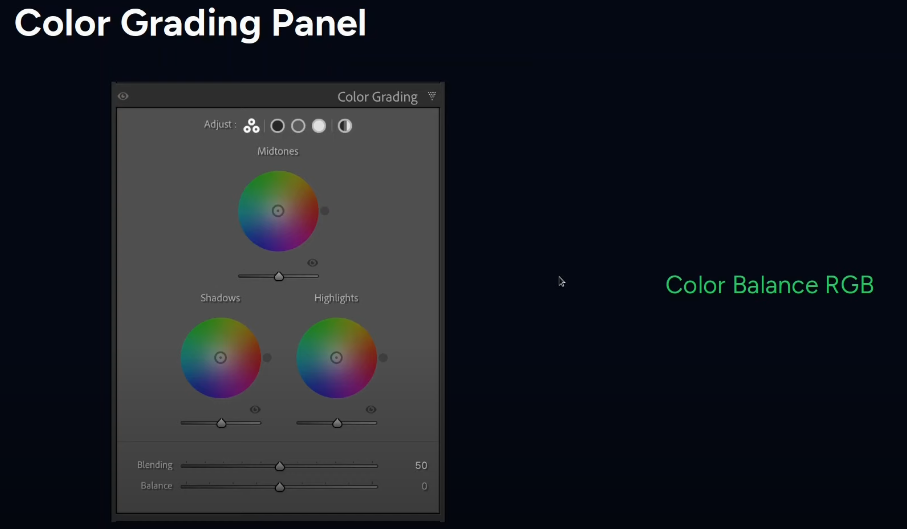
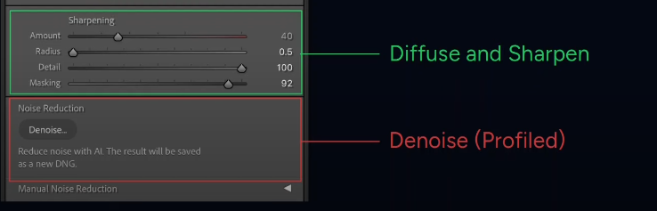
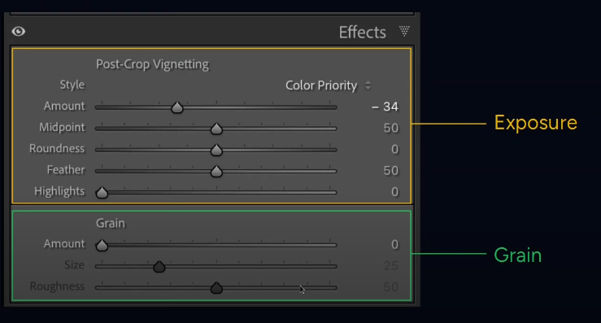
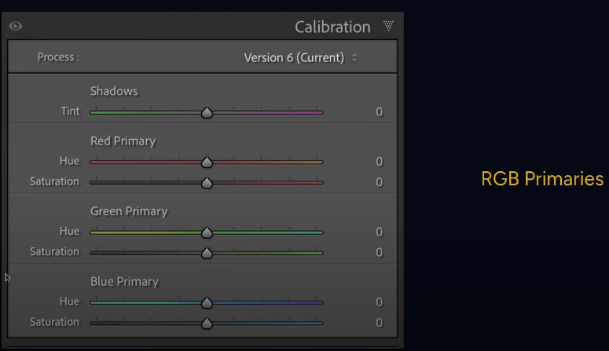

```bash
 _     _____ ___  _   _ _____
| |   | ____/ _ \| \ | |__  /
| |   |  _|| | | |  \| | / / 
| |___| |__| |_| | |\  |/ /_ 
|_____|_____\___/|_| \_/____|
                             
```

# Darktable - Configs, workflow, settings
_Updated October 2025_

## [CREDITS]
[Kevin Ajili](https://www.youtube.com/@kevinajili)
[Darktable Landscapes](https://www.youtube.com/@DarktableLandscapes)

**Lighttable Workflow, prior to editing**

1. Import from existing directory, apply any metadata presets
2. Reject/pick/rate photos
3. Apply tags, collections, any other metadata
5. Apply styles if needed
6. Edit in Darktable below

### OPTION 1 - Modified Scene-Referred workflow modules
> Reference [this video from Kevin](https://www.youtube.com/watch?v=ZUc6LOzg_Nk) for 5.0+ workflow and settings > If stitching Panoramas using hugin, use [this video from Darktable Landscapes](https://www.youtube.com/watch?v=pxuLCLpRPrs)  for reference. Edit after exporting/stitching


- Make sure defaults and presets are setup as described in the video
- Auto-apply the following to all (raw only): **lens correction, hotpixels, denoise (profiled), chromatic aberrations, color balance RGB (based on basic colorfullness standard**
  

**WORKFLOW - BASE**
1. Exposure. Use  lightbulb (Ctrl-B for white border reference)
2. Color Calibration.  _Instead of White Balance_ Use the eye dropper to sample a neutral area, dragging the box around for variations, then fine-tune. Leave WB module at D65 if using Color Calibration in the pipeline.  Check that “area color mapping” is set to (50, 0°, 0)
3. Crop
4. Rotate & Perspective. Right-click to draw a line that will align the photo
5. Tone Equalizer (Shadows & Highlights is a simpler alternative):
   - The Advanced tab shows a curve that represents the adjustments. Its histogram shows the mask it creates.
    - The Masking tab helps create a mask based on tonal values. **The entire module has its own mask via this tab**
    - The "magic wands" can help create an initial mask.
    - Verify the mask doesn't cause clipping (indicated by colors).
    - Use "Guided Filter" or "EIGF" (preserves contrast)  for smoother transitions.
    - The cursor can auto-adjust zones for a smoother curve.
A good starting preset without even using mask is often "Compress Shadows EIGF soft," then adjust the curve.

**WORKFLOW - COLOR**
1. Color Balance RGB - used for both Saturation & Contrast - use either same instance or separate. OK to generally increase saturation in the shadows and decrease it in the highlights. 
   **_COLOR_**:
   Master tab:
   - Use _global vibrance_ slider to adjust overall colorfullness but if not enough, then:
   - [OPTIONAL] _Chroma_ sliders adjust colors without affecting luminance
   - [OPTIONAL] _Saturation_ sliders apply absolute amount (standard preset already adds some saturation)
    **_CONTRAST_**: - optionally make a separate instance from Saturation above
     master tab:
	 - Adjust mid-tones, shadows and highlights under _brilliance_ grading
     4-ways tab:
     - Use _global offset luminance_ slider to adjust black level for more contrast adjustments
2. Sigmoid - should already be set. Use **smooth** profile as an option for a good look especially for photos with heavy highlights like sunsets
     - Adjust _contrast_ slider if needed and _skew_ slider to move contrast towards highlights or shadows
     - _preserve hue_ slider may or may not make a photo more interesting (such as to make highlights glow more, like fire or sunsets). 38% works well
     - _target_ sliders usually OK to stay at default but similar to luminance sliders used in ColorRGB
     - _primaries_ sliders for each color add or decrease colors in **highlights** only

**WORKFLOW - COLOR GRADING**
1. RGB Primaries - simpler channel mixer for broader changes before Color Equalizer is used for more detailed adjustments
   - Change hue of each channel towards opposite color (reds towards magenta, etc). Purity controls saturation
2. Color Equalizer - adjust specific colors or use **picker** on the image, then use _node placement_ to align the dot
        > Color look up table module can be used for quick color replacements with color picker tool 
    - Hue tab is rarely used since RGB Primaries shoud do a good job. Middle-click to reveal sliders for each color
    - brightness and saturation tabs can be used for fine adjustments
3. Color Balance RGB - used for split toning (make a new instance) in the **4-ways tab**
    - Use the _hue_ slider to select color from the image or use picker, then use _chroma_ slider for color gain
    - Do this for shadows, then repeat for highlights (although highlights effect is small)

**WORKFLOW - CREATIVE**
1. Diffuse or sharpen - select preset sharpen demosaicing AA filter should provide a natural sharpness level
   _Lens deblur medium_ is another good preset for shaprness
2. Contrast Equalizer -similar to Clarity in Lightroom when _clarity_ preset is used
   - On the _Luma_ tab, use mix slider to change positive or negative clarity
   - If more control is needed in just coarse areas or fine areas, adjust parts of the graph. Increasing _fine_ areas adds more sharpness/micro-contrast. Or bring down the _[coarse](https://www.canon-europe.com/cameras/eos-r6-mark-ii/specifications/)_ side to apply negative clarity without messing with sharpness
3. [OPTIONAL] Glowing effect. Diffuse or sharpen - make new instance, apply preset bloom, adjust opacity
4. Haze Removal - Increase or decrease (for a gloomy look) haze
5. Grain
6. Retouch - use shape/brush/path to select areas
7. Framing
8. Watermark

### Other useful modules
- Color Zones for hue, chroma, lightness of areas of the photo (i.e. brighten up greens and desaturate reds) - if Color Equalizer doesn't suffice
- Velvia - primarily boosts saturation and contrast in a way that often emphasizes warmer tones and creates a punchy, vivid look
- Hot Pixels - remove abnormally bright pixels
- Graduated density - Simulate optical graduated ND filter

### OPTION 2 - Lightroom-style  workflow modules
> Reference [this video from Darktable Landscapes](https://www.youtube.com/watch?v=6SflKR6JYrk) for using Darktable's tools that mimic Lightroom workflow
#### Tools & Modules - Lightroom comparison







| Darktable Module (Suggested Order)                        | Lightroom Equivalent                                         | Notes                                                                                                                                                                                                                                                             |
|-----------------------------------------------------------|--------------------------------------------------------------|-------------------------------------------------------------------------------------------------------------------------------------------------------------------------------------------------------------------------------------------------------------------|
| 1. **Crop and Rotate**                                    | Crop Tool                                                    | Adjust composition first.                                                                                                                                                                                                                                         |
| 2. **Exposure**                                           | Basic Panel: Exposure                                        | Set overall brightness. *Tip:* Leave "compensate camera exposure" ticked for a more natural starting point.                                                                                                                                                       |
| 3. **Sigmoid**                                            | Basic Panel: Highlights, Shadows, Whites, Blacks, Tone Curve | Tone mapping. Simpler than Filmic RGB for beginners.                                                                                                                                                                                                              |
| 4. **Color Calibration**                                  | Basic Panel: White Balance, Color                            | *Instead of White Balance.* Use the eye dropper to sample a neutral area, dragging the box around for variations, then fine-tune.                                                                                                                                 |
| 5. **Color Balance RGB**                                  | Color Panel/Color Grading                                    | Adjust global vibrance, contrast, perceptual saturation (shadows, midtones, highlights), and perceptual brilliance grading.                                                                                                                                       |
| 6. **Tone Curve** (or masked secondary Color Balance RGB) | Tone Curve, Color Grading with Masking                       | Adjust midtones. Tone Curve is often easier for beginners than a masked Color Balance RGB module.                                                                                                                                                                 |
| 7. **Haze Removal**                                       | Dehaze                                                       | Remove atmospheric haze if needed.                                                                                                                                                                                                                                |
| 8. **Contrast Equalizer**                                 | Clarity, Texture                                             | Enhance clarity and local contrast. *Tip:* Use Ansel Adams' presets as a starting point.                                                                                                                                                                          |
| 9. **Color Equalizer**                                    | HSL                                                          | Adjust hue, saturation, and brightness by selecting color areas with the eye dropper.                                                                                                                                                                             |
| 10. **Color Balance RGB**                                 | Color Grading                                                | Use for refined color grading. *Note:* Using the "4 ways" tab can be complex, and using RGB Primaries instead is fine, as is basic global adjustments. If the 4 ways tab confuses you, stick to the basics of Color Balance RGB, or use the RGB primaries module. |
| 11. **Denoise (Profiled)**                                | Detail Panel: Noise Reduction                                | Apply noise reduction. Verify profile is applied correctly.                                                                                                                                                                                                       |
| 12. **Lens Correction**                                   | Lens Corrections                                             | Apply lens corrections.                                                                                                                                                                                                                                           |
| 13. **Chromatic Aberrations**                             | Lens Corrections                                             | Remove chromatic aberration, if needed.                                                                                                                                                                                                                           |
| 14. **Vignetting** (or masked Exposure)                   | Effects Panel: Vignetting                                    | Apply vignetting. *Note:* The vignette module is much simpler than a manually created masked exposure vignette. Avoid masked exposure until more experience with darktable is gained.                                                                             |
| 15. **RGB Primaries** (Optional)                          | Camera Calibration                                           | Make subtle color hue adjustments to final image.                                                                                                                                                                                                                 |
| 16. **LUTs**                                              | Profiles, LUTs                                               | Apply LUTs for specific looks. *Note:* Apply after most color adjustments. Consider using instead of some dtstyles, or in addition to dtstyles, depending on the need. Experimenting with both is advised.                                                        |
| 17. **Diffuse or Sharpen**                                | Detail Panel: Sharpening                                     | Final sharpening. *Tip:* Use profiles with sharpening and demosaicing, and set "no AA filter" if relevant. Use diffuse for creative softening effects, if that is the goal.                                                                                       |
| 18. **Snapshot/Compare:**                                 | Not Applicable                                               | Take a snapshot and use the slider to compare before and after.                                                                                                                                                                                                   |
| 19. **Framing**                                           | Not Applicable                                               | Final framing/composition adjustments, if needed (outside darktable).                                                                                                                                                                                             |

**AFTERWARDS**
1. Check for any clipping (o)
2. Export photo, (re) apply any styles -  90% quality good for most uses with manageable file size. Use sRGB profile and high quality resampling options
    **TIP:** Hold down the left mouse button on a thumbnail to temporarily show that version in the center view.
3. Tag as needed including style
4. Geotag
5. Rate and/or apply color rating
6. Delete rejected photos
   
## Masking
**Example - Parametric**
- Select parameter / channel
- Turn on preview (yellow area is selected)
- Use sliders to make exact or smooth selection area
- Use feathering to decrease harshness in the mask
- Turn off preview (unselect yellow)
- Use module's power button to see before/after of the module w/mask applied
- To reuse masks, use Mark Manager and select existing masks or mask groups  from another module

TIPS:

- Right-clicking a mask on the image removes it
- When using Elliptical mask, shift-left click changes feather from proportional ratio to uniform
- When using path mask using Ctrl-left click for hard shapes like triangles
- Ctrl-click to add a node to an existing mask to make a more detailed mask shape. Right-click on node to remove the node
- Use eye dropper to select exact color for the channel sliders 
- **Uniformity** provides opacity/strength for ANY module

## Styles, Presets, etc
> Using basic styles like in-camera JPEG rendition is a good starting point - These styles only affect contrast, brightness, and saturation and do not attempt to match **sharpening, denoising, or hue shifts**.  There is also a Lua script to auto-apply the appropriate style on import and manually apply styles to a collection of previously-imported images.
> When applying a style, it's best to start with the original, unedited image in the history stack
> Workflow should focus around OSC principal (Overall, Subject, Colors)

* For LUTs - apply specific profile, then use the _circle_ mask icon (uniformly) to change opacity/strength of the LUT
* Download .dtstyle files and store in `~/Pictures/Darktable`
* If saving a new style, only save relevant modules and avoid defaults like Sigmoid which will be auto-applied anyway
* Create a style by compressing history stack first - important to click 'module order'
	> If using a style, indicate the style name in the snapshot and/or duplicate. There  should also be  an associated tag with the style
* If using  [Kevin's creative styles](https://github.com/kajili/darktable-styles) , exposure and color/calibration are excluded  - those still have to be applied per photo
* If updating a style, compress history stack, make changes, compress history stack again before re-saving with the same exact name,overwrite
* When applying a style - use 'overwrite' for creative/general styles and 'append' for _tools_ type of styles

### t3mujinpak - Popular & Versatile Styles: 

* **Black & White:**
 > If manually converting to B&W, Color Calibration module has good film presets
* **Ilford HP5 Plus 400:** A classic black and white film known for its versatility, good grain structure, and pleasing tonality. Often a go-to for general B&W work.
* **Kodak Tri-X 400:** Another iconic B&W film, often favored for its distinctive grain and contrast. Great for a more gritty or dramatic B&W look.
* **Ilford Delta 100:** Known for its very fine grain and smooth tonality, excellent for high-detail B&W images.
* **Fuji Neopan Acros 100:** Known for its extremely fine grain and high sharpness, often favored by architectural and landscape photographers.

* **Color Negative:**

  * **Kodak Portra 400:** Extremely popular for its natural skin tones, smooth gradients, and versatility. Often used for portraits, landscapes, and general photography.
  * **Fuji Pro 400H:** Another favorite for portraits and natural colors, often described as having a slightly cooler and more pastel rendition compared to Portra.
  * **Kodak Ektar 100:** Known for its very fine grain and vibrant, yet realistic, color rendition. Popular for landscapes and detailed subjects.
    * **Fuji Superia 400:** A popular consumer film known for its punchy colors and versatility.

* **Color Slide:**

  * **Fuji Velvia 50:** Famous for its incredibly saturated and contrasty colors, often used for landscapes and nature photography when vividness is desired.
  * **Fuji Provia 100F:** A more neutral and versatile slide film with fine grain and accurate colors, often used for a wide range of subjects.
   * **Kodak Ektachrome 100 G:** Known for its relatively neutral color balance and fine grain.

## Misc.
- Use duplicates for things like mutiple versions of the same photo (different styles, crops, frames) or to test edits safely
**Update lens and camera database**
```bash
sudo apt install liblensfun-bin
lensfun-update-data #use sudo for system-wide update
```
### General Tips:

Right-Click for Value Input: right-clicking on sliders or numerical values allows you to type in precise values. 
Double-Click to Reset: Double-clicking on a slider or numerical value resets it to its default setting.
Ctrl-Alt to scroll without using scroll bar
Scroll Wheel for Fine Adjustments: Use your mouse scroll wheel to make small adjustments to sliders. Holding Shift or Ctrl while scrolling allows for coarser/finer adjustments.
Middle mouse button is 200% zoom
Clicking on a brush or shape (like in masking) while holding CTRL keeps the brush enabled (vs exiting the brush)
When using a tool - to zoom instead of adjusting a control/shape, hold down the ‘a’ key while scrolling

**Module Presets:**
Create and save module presets for frequently used settings. This saves time and ensures consistency.
You can right click on the module name to save presets.
Hovering over the preset in a module (like LUTs) allows you to use the mouse wheel to scroll through the LUTs stored in that directory:

**Rating system**
  1 star for a photo I want to keep but not show (for record purposes, part of a pano series, etc.)
  2 stars for a photo I will show as part of a photo album
  3 stars for a photo I would put up on my wall
  4/5 stars for a portfolio-worthy photo

  **Color ratings**
🟣 Purple: Editing done, finished

🔴 Red: "Needs Editing" - photos that are flagged for editing but not yet started.

Example: Raw files that are high-priority or part of a client project.

🟡 Yellow: "In Progress" - Photos you’re actively editing (e.g., halfway through adjustments).
 
🟢 Green: "Ready for Export" i.e - edited photos that just need final export (resizing, sharpening, etc.).

🔵 Blue: Part of Panorama stack while editing. 

**Hugin panorama stitcher tips**
- Keep resolution dimensions during export from Darktable and for Panorama (R6m2 is 6022x4024)
- Use _straighten_ button on the Move/Drag tab
- Use  Projection tab to set type of pano:
	 Rectilinear: Good for narrow panoramas
    Cylindrical: Good for wide, horizontal panoramas
- Save project files and pano TIFFs (tar themi)
`exiftool -TagsFromFile IMG_1234.TIF -all:all panorama_output.tif` will reimport EXIF info

## Installation, etc
- On Debian Trixie, install binary directly from Debian Testing (stable) section: [here](https://software.opensuse.org/download.html?project=graphics:darktable&package=darktable) - Installing via custom repo doesn't seem to work as of August 2025
- To check if OpenCL is available - run `darktable-cltest`