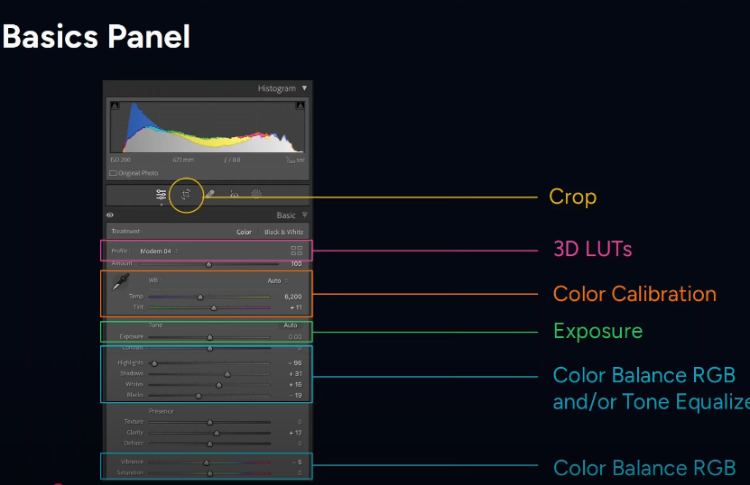
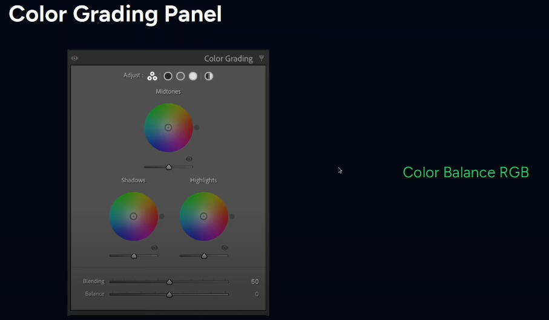
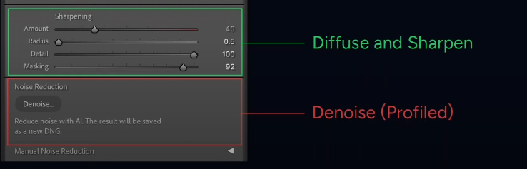
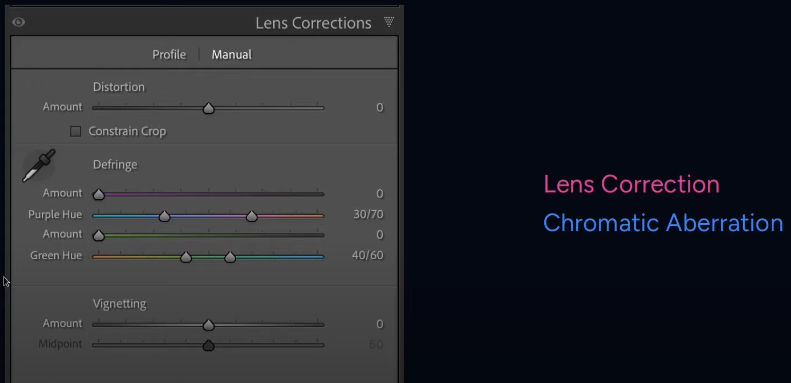
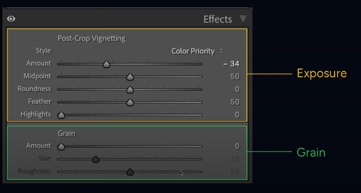
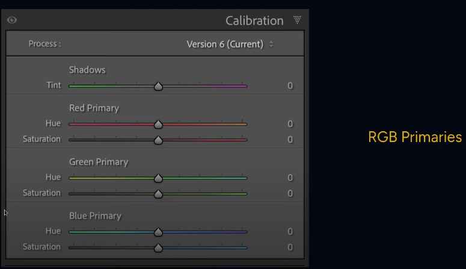

```bash
 _     _____ ___  _   _ _____
| |   | ____/ _ \| \ | |__  /
| |   |  _|| | | |  \| | / / 
| |___| |__| |_| | |\  |/ /_ 
|_____|_____\___/|_| \_/____|
                             
```

# darktable - [Deprecated] Workflow archive
_Updated October 2025_

Current, updated workflow [here](darktable.md)

### [⚠ NO LONGER USING] OPTION 2 - Lightroom-style  workflow modules
> Reference [this video from Darktable Landscapes](https://www.youtube.com/watch?v=6SflKR6JYrk) for using darktable's tools that mimic Lightroom workflow
#### Tools & Modules - Lightroom comparison







| Darktable Module (Suggested Order)                        | Lightroom Equivalent                                         | Notes                                                                                                                                                                                                                                                             |
|-----------------------------------------------------------|--------------------------------------------------------------|-------------------------------------------------------------------------------------------------------------------------------------------------------------------------------------------------------------------------------------------------------------------|
| 1. **crop and rotate**                                    | Crop Tool                                                    | Adjust composition first.                                                                                                                                                                                                                                         |
| 2. **exposure**                                           | Basic Panel: Exposure                                        | Set overall brightness. *Tip:* Leave "compensate camera exposure" ticked for a more natural starting point.                                                                                                                                                       |
| 3. **sigmoid**                                            | Basic Panel: Highlights, Shadows, Whites, Blacks, Tone Curve | Tone mapping. Simpler than filmic rgb for beginners.                                                                                                                                                                                                              |
| 4. **color calibration**                                  | Basic Panel: White Balance, Color                            | *Instead of White Balance.* Use the eye dropper to sample a neutral area, dragging the box around for variations, then fine-tune.                                                                                                                                 |
| 5. **color balance rgb**                                  | Color Panel/Color Grading                                    | Adjust global vibrance, contrast, perceptual saturation (shadows, midtones, highlights), and perceptual brilliance grading.                                                                                                                                       |
| 6. **tone curve** (or masked secondary Color Balance RGB) | Tone Curve, Color Grading with Masking                       | Adjust midtones. tone curve is often easier for beginners than a masked color balance rgb module.                                                                                                                                                                 |
| 7. **haze removal**                                       | Dehaze                                                       | Remove atmospheric haze if needed.                                                                                                                                                                                                                                |
| 8. **contrast equalizer**                                 | Clarity, Texture                                             | Enhance clarity and local contrast. *Tip:* Use Ansel Adams' presets as a starting point.                                                                                                                                                                          |
| 9. **color equalizer**                                    | HSL                                                          | Adjust hue, saturation, and brightness by selecting color areas with the eye dropper.                                                                                                                                                                             |
| 10. **color balance rgb**                                 | Color Grading                                                | Use for refined color grading. *Note:* Using the "4 ways" tab can be complex, and using RGB Primaries instead is fine, as is basic global adjustments. If the 4 ways tab confuses you, stick to the basics of color balance rgb, or use the rgb primaries module. |
| 11. **denoise (Profiled)**                                | Detail Panel: Noise Reduction                                | Apply noise reduction. Verify profile is applied correctly.                                                                                                                                                                                                       |
| 12. **lens correction**                                   | Lens Corrections                                             | Apply lens corrections.                                                                                                                                                                                                                                           |
| 13. **chromatic aberrations**                             | Lens Corrections                                             | Remove chromatic aberration, if needed.                                                                                                                                                                                                                           |
| 14. **vignetting** (or masked Exposure)                   | Effects Panel: Vignetting                                    | Apply vignetting. *Note:* The vignette module is much simpler than a manually created masked exposure vignette. Avoid masked exposure until more experience with darktable is gained.                                                                             |
| 15. **rgb primaries** (Optional)                          | Camera Calibration                                           | Make subtle color hue adjustments to final image.                                                                                                                                                                                                                 |
| 16. **luts**                                              | Profiles, LUTs                                               | Apply luts for specific looks. *Note:* Apply after most color adjustments. Consider using instead of some dtstyles, or in addition to dtstyles, depending on the need. Experimenting with both is advised.                                                        |
| 17. **diffuse or sharpen**                                | Detail Panel: Sharpening                                     | Final sharpening. *Tip:* Use profiles with sharpening and demosaicing, and set "no AA filter" if relevant. Use diffuse for creative softening effects, if that is the goal.                                                                                       |
| 18. **snapshot/compare:**                                 | Not Applicable                                               | Take a snapshot and use the slider to compare before and after.                                                                                                                                                                                                   |
| 19. **framing**                                           | Not Applicable                                               | Final framing/composition adjustments, if needed (outside darktable).                                                                                                                                                                                             |