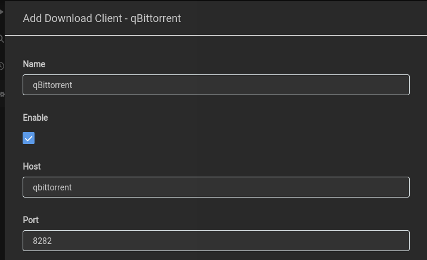
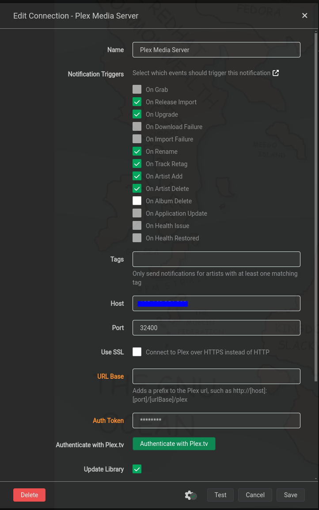

```
 _     _____ ___  _   _ _____
| |   | ____/ _ \| \ | |__  /
| |   |  _|| | | |  \| | / / 
| |___| |__| |_| | |\  |/ /_ 
|_____|_____\___/|_| \_/____|
```
_Updated February 2025_

# ARR stack (with VPN) setup on podman
- Decent overall guide for podman (but older version) [here](https://medium.com/@Pooch/containerized-media-server-setup-with-podman-3727727c8c5f)
- Decent basic `arr` configurtion guide [on YouTube](https://www.youtube.com/watch?v=1eqPmDvMjLY) and its [wiki](https://github.com/automation-avenue/youtube-39-arr-apps-1-click)
- Most containers specify UID of 1000 - I'm replacing with UID 0 since these run on rootless `podman_service` account, which has UID of 1001 and should have NFS permissions
- To protect the entire setup, **gluetun** will run as an anchor to all `arr` containers and connect to external VPN and all other containers will use `--network=container:gluetun` flag to piggyback off **gluetun**
    - Great general guide to glue all these together [by TechHut](https://github.com/TechHutTV/homelab/tree/main/media#testing-gluetun-connectivity)
    - [Proton VPN's port forwarding instructions](https://protonvpn.com/support/port-forwarding-manual-setup)
    - [Gluetun's Proton VPN-specific wiki](https://github.com/qdm12/gluetun-wiki/blob/main/setup/providers/protonvpn.md#required-environment-variables)

## Pre-requisites/Prep

1. Verify podman functions correctly and rootless containers can be deployed
2. Add necessary firewall ports to home zone
```bash
sudo firewall-cmd --permanent --zone=home --add-port=8989/tcp #sonarr
sudo firewall-cmd --permanent --zone=home --add-port=7878/tcp #radarr
sudo firewall-cmd --permanent --zone=home --add-port=6787/tcp #NZBGet
sudo firewall-cmd --permanent --zone=home --add-port=9696/tcp #prowlarr
sudo firewall-cmd --permanent --zone=home --add-port=8787/tcp #readarr
sudo firewall-cmd --permanent --zone=home --add-port=8686/tcp #lidarr
sudo firewall-cmd --permanent --zone=home --add-port=5055/tcp #overseerr
sudo firewall-cmd --permanent --zone=home --add-port=8282/tcp #qbittorrent
sudo firewall-cmd --permanent --zone=home --add-port=6881/tcp #qbittorrent
sudo firewall-cmd --permanent --zone=home --add-port=6881/udp #qbittorrent
sudo firewall-cmd --permanent --zone=home --add-port=3300/tcp #firefox-vpn
sudo firewall-cmd --reload
```
3. Create / verify access to `/mnt/media` and make sure `podman_service` can access the share
    - NOTE: `fstab` file entry: `192.168.254.230:/mnt/z1pool/media   			/mnt/media    		nfs    nfsvers=4,rsize=8192,wsize=8192,timeo=14,retrans=2,hard,intr,x-systemd.requires=network-online.target,x-systemd.automount,x-systemd.idle-timeout=1min    0    0`
	- run `mount -a` to verify

## Creating containers

### Gluetun
1. Create podman volumes:
```bash
podman volume create gluetun_config
```
2. Start the container using the config file  [here](https://github.com/leonzwrx/homelab-wiki/blob/main/podman_configs/gluetun.txt)
3. Verify this container runs first and external connection is successful before creating others
_**Testing Gluetun Connectivity**_
Once you Gluetun container is up and running, you can test your connection is correct and secured. This assumes you keeP the gluetun container name. Learn more at the gluetun [wiki](https://github.com/qdm12/gluetun-wiki/blob/main/setup/test-your-setup.md).
```bash
podman run --rm --network=container:gluetun alpine:3.18 sh -c "apk add wget && wget -qO- https://ipinfo.io"
```
### Sonarr
1. Create podman volumes:
```bash
podman volume create sonarr_config
```
2. Start the container using the config file [here](https://github.com/leonzwrx/homelab-wiki/blob/main/podman_configs/sonarr.txt)
### Radarr
1. Create podman volumes:
```bash
podman volume create radarr_config
```
2. Start the container using the config file [here](https://github.com/leonzwrx/homelab-wiki/blob/main/podman_configs/radarr.txt)
### Prowlarr
1. Create podman volumes:
```bash
podman volume create prowlarr_config
```
2. Start the container using the config file [here](https://github.com/leonzwrx/homelab-wiki/blob/main/podman_configs/prowlarr.txt)
### Readarr
1. Create podman volumes:
```bash
podman volume create readarr_config
```
### Lidarr
1. Create podman volumes:
```bash
podman volume create lidarr_config
```
2. Start the container using the config file [here](https://github.com/leonzwrx/homelab-wiki/blob/main/podman_configs/lidarr.txt)
### NZBGet
1. Create podman volumes:
```bash
podman volume create nzbget_config
```
2. Start the container using the config file [here](https://github.com/leonzwrx/homelab-wiki/blob/main/podman_configs/nzbget.txt)
### qBittorrent
1. Create podman volumes:
```bash
podman volume create qbittorrent_config
```
2. Start the container using the config file [here](https://github.com/leonzwrx/homelab-wiki/blob/main/podman_configs/qbittorrent.txt)
### Overseerr
1. Create podman volumes:
```bash
podman volume create overseerr_config
```
2. Start the container using the config file [here](https://github.com/leonzwrx/homelab-wiki/blob/main/podman_configs/overseerr.txt)
### firefox-vpn
This is useful to be connected to the rest of the stack for any communication with indexers/trackers, etc
1. Create podman volumes:
```bash
podman volume create firefox-vpn_config
podman volume create firefox-vpn_cache
```
2. Start the container using the config file [here](https://github.com/leonzwrx/homelab-wiki/blob/main/podman_configs/firefox-vpn.txt)
# Communication & core configuration
- To test other containers' VPN link: run:
```bash
podman exec -it container_name bash
wget -qO- https://ipinfo.io
```

- For all newly deploying `arr` containers, login and set admin credentials
- In **qBittorrent**:
  1. grab temp password from container's logs and change it
  2. - Go to Tools - Options - WebUI - change the user and password and tick 'bypass authentication for clients on localhost' .
       - Set NIC to tun0: 
       
- In **NZBGet**:
  1. Change both regular and control passwords (username nzbget)
  2. Add a new category `Uncategorized`, `Books`, rename `Series` to `TV` and make any other  category change if needed
- In **Prowlarr**:
1. Go to Settings - Download Clients - + symbol - Add download client - choose qBittorrent (unless you decided touse different download client)
2. Put the port id matching the WebUI in docker-compose for qBittorrent (set to 8282) and username and password that you configured for qBittorrent in previous step
3. Host - you have to change from localhost to name of the container, like `qbittorrent`:
   	
4. Add another download client - NZBGet (specify credentials) - use the category created above:

- In **Sonarr**:
1. Go to Settings - Media Management - Add Root Folder - set `/tv` as your root folder
2. Go to Settings - Download Clients - click + symbol - choose qBittorrent and repeat the steps from Prowlarr. Add NZBGet, same as above (use Category TV)
3. Go to Settings - General - scroll down to API key - copy - go to Prowlarr - Settings - Apps -click '+' - **Sonarr** - paste API key and change 'localhost' to container names as seen below
   

- In **Radarr**:
1. Go to Settings - Media Management - Add Root Folder - set `/movies` as your root folder
2. Go to Settings - Download Clients - click + symbol - choose qBittorrent and repeat the steps from Prowlarr. Add NZBGet, same as above (use category Movies)
3. Go to Settings - General - scroll down to API key - copy - go to Prowlarr - Settings - Apps -click '+' - **Radarr** - paste API key and change 'localhost' to container names, same as above
   
- In **Readarr**:
1. Go to Settings - Media Management - Add Root Folder - set `/books` as your root folder
2. Go to Settings - Download Clients - click + symbol - choose qBittorrent and repeat the steps from Prowlarr. Add NZBGet, same as above (use category Books)
3. Go to Settings - General - scroll down to API key - copy - go to Prowlarr - Settings - Apps -click '+' - **Readarr** - paste API key and change 'localhost' to container names, same as above

- In **Lidarr**:
1. Go to Settings - Media Management - Add Root Folder - set `/books` as your root folder
2. Go to Settings - Download Clients - click + symbol - choose qBittorrent and repeat the steps from Prowlarr. Add NZBGet, same as above (use category Music)
3. Go to Settings - General - scroll down to API key - copy - go to Prowlarr - Settings - Apps -click '+' - **Lidarr** - paste API key and change 'localhost' to container names, same as above

- In **Overseer**
NOTE: If getting error `The /config volume mount was not configured properly. All data will be cleared when the container is stopped or restarted.` - this is a known bug as of March 2024, can be ignored
1. Connect to Plex and sync libraries:

2. Configure both Sonarr and Radarr as seen below:


3. Go over all remaining settings (users, profiles, etc)
4. Verify Plex watchlists sync and homepage widgets work+
5. Make sure notifications / email settings are set correctly
# Other settings
- In **Prowlarr**:
1. Add appropriate indexers/torrents, then click "Sync App Indexers". Set seed ratios

- In **Lidarr**:
1. Uncheck "Replace Illegal Characters" under Media - Management
2. Under Settings - Download Clients, uncheck "Remove Downloaded Files" and "Import Automatically"

- **Permissions (all arrs)**
Set the following permission changes in all (775 or similar):


- **Plex Connection (all arrs)**
  1. Settings - Connect - Add connection to Plex:
  
# Issues / Troubleshooting
- SELinux may prevent gluetun to properly run and throw errors similar to `TUN device is not available: open /dev/net/tun: permission denied`
    - Currently running this container in with `--privileged` flag but may troubleshoot this further later - [link](https://github.com/qdm12/gluetun-wiki/blob/main/errors/tun.md)
 
## VPN Port forwaring with qBittorrent
The script [here](/assets/sync_qbt_to_gluetun_port.sh) will call Gluetun API to get the current forwarded port, qBittorrent's API to get the currently configured port, and in case those two ports don't match, update qBittorrent's port.

For this to work, you need to :

1. Activate Bypass authentication for clients on localhost in Options > WebUI
gluetun and
2. qBitTorrent need to be on the same docker network (usually already done if using service:gluetun
3. Test by getting the port number from gluetun first: `podman logs gluetun | grep "port forwarded is" | tail -1 | awk '/port forwarded is/ {print $NF}')`