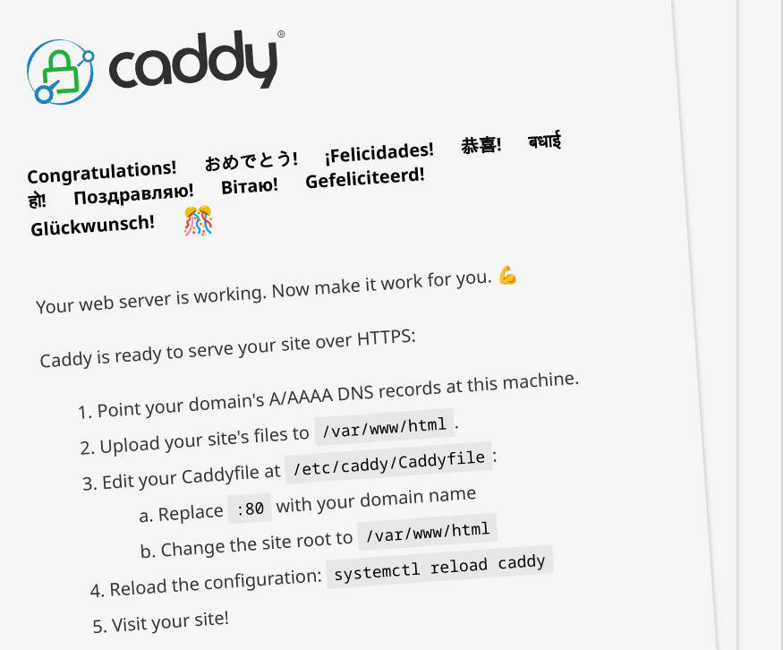

```
 _     _____ ___  _   _ _____
| |   | ____/ _ \| \ | |__  /
| |   |  _|| | | |  \| | / / 
| |___| |__| |_| | |\  |/ /_ 
|_____|_____\___/|_| \_/____|
```
_Updated January 2025_

# Caddy reverse proxy setup on podman (RHEL 9)
- Caddy implicitly activates automatic HTTPS when it knows a domain name (i.e. hostname) or IP address it is serving.
- Caddy automatically applies _Let's Encrypt_ SSL cert
- General Caddy automatic HTTPS guide [here](https://caddyserver.com/docs/automatic-https)

## Prerequisites

- Caddy temporarily serves a special file on port 80 to prove to Let's Encrypt that it controls the domain.
    - For this to work, your DNS CNAME record (cname.nilva.net) must resolve to your public IP (via example.asuscomm.com).
    - Port 80 must be forwarded to your Caddy server.
- For HTTP-01 challenge to work with SSL certs with Let's Encrypt cert, edit domain registrar and/or external DNS records 
    1. Create appropriate A or CNAME records with public DNS manager
    2. No additional DNS records are needed for the HTTP-01 challenge
  - Verify podman host that will run Caddy isn't listening on :80 or :443
  - Set up  port  forwarding for ports 80 and 443 from external sources to  Caddy's podman host IP
        - Port 80 is required for the HTTP-01 challenge, which Let's Encrypt uses to validate that you control the domain. 
        - It allows initial HTTP requests, which Caddy can redirect to HTTPS automatically.
  * Example flow:
            1) A client connects to http://rss.nilva.net (port 80)
            2) Caddy responds to the HTTP request or redirects it to HTTPS (port 443).
         - Port 443 is required for HTTPS traffic, which is the secure communication protocol.
        - It allows Caddy to serve all encrypted requests over this port once the certificate is issued.
  * Example flow:
  1. A client connects to `https://rss.nilva.net` (port 443).
  2. Caddy handles the request securely using the TLS certificate.

## Setup/Configuration
1. Add necessary firewall ports to home zone
```bash
firewall-cmd --zone=home --add-service=http
firewall-cmd --zone=home --add-service=https
firewall-cmd --permanent --zone=home --add-service=http
firewall-cmd --permanent --zone=home --add-service=https
```
2. Create podman volumes:
```bash
podman volume create caddyfile
podman volume create caddy_data
podman volume create caddy_config
```
3. Start the rootful container using the config file [here](https://github.com/leonzwrx/homelab-wiki/blob/main/podman_configs/caddy.txt)
4. Verify Caddy functionality by lauching podman host's default port 80 page:

5. Edit the Caddy file and enable HTTPS - this configuration tells caddy to manage rss.nilva.net and enables Let“s Encrypt for HTTPS automatically (serves files from `/usr/share/caddy` and redirects HTTP requests to HTTPS)
```
rss.nilva.net {
    root * /usr/share/caddy  # Path to your website files
    file_server              # Serve static files
    
    # Optional: Uncomment to enable logging
    # log {
    #     output file /var/log/caddy/access.log
    # }

    # Optional: Redirect HTTP to HTTPS
    @http {
        protocol http
    }
    redir @http https://{host}{uri} permanent
}
```
6. Restart caddy container: `podman restart caddy` and verify certificate has been installed
7. If all other  testing successful, change Caddyfile again to use reverse proxy (and restart caddy again)
```
rss.nilva.net {
    reverse_proxy rhel9-apps.nilva.local:8081

    # Optional: Enable logging
    # log {
    #     output file /var/log/caddy/rss_access.log
    # }

    # Optional: Enable compression for better performance
    encode gzip zstd
}
```