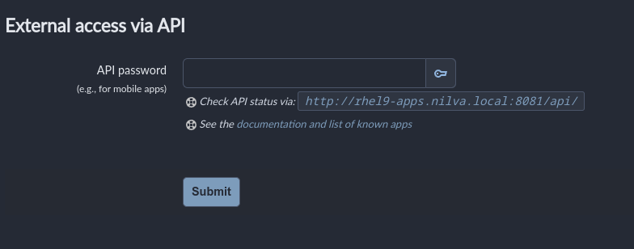

```
 _     _____ ___  _   _ _____
| |   | ____/ _ \| \ | |__  /
| |   |  _|| | | |  \| | / / 
| |___| |__| |_| | |\  |/ /_ 
|_____|_____\___/|_| \_/____|
```
_Updated January 2025_

# FreshRSS setup on podman (RHEL 9)
	
## Prerequisites/Prep

1. Verify podman functions correctly and rootless containers can be deployed
2. Add necessary firewall ports to home zone
```bash
sudo firewall-cmd --zone=home --add-port=8081/udp
sudo firewall-cmd --permanent --zone=home --add-port=8081/tcp
```
3. Create podman volumes:
```bash
sudo podman volume create freshrss_data
sudo podman volume create freshrss_extensions
```
4. Pull the image
```bash
sudo podman pull docker.io/freshrss/freshrss:latest
```
5. Start the container using the config file [here](https://github.com/leonzwrx/homelab-wiki/podman_configs/freshrss.txt)

## Setup / Configuration
- Go thru default configs using SQLite - decent guide [here](https://www.youtube.com/watch?v=bWRN93LYRpM)
- Set up default/first user
- Configure Display/Themes configuration and overall look/feel settings
- Install /edit extensions (may need to add Github SSH keys first):
```bash
[podman_service@rhel9-apps _data]$ pwd
/var/lib/podman_service/.local/share/containers/storage/volumes/freshrss_extensions/_data
[podman_service@rhel9-apps _data]$ git clone ssh://git@github.com/FreshRSS/Extensions.git
```bash
```
this may include some custom extensions:
```bash
[podman_service@rhel9-apps _data]$ git clone https://github.com/kapdap/freshrss-extensions
```
- Configure sharing options and email (configure `/data/config.php`)
  (may need to add Google's app password / API key and use that as a password below)
  ```
	'mailer' => 'smtp',
  'smtp' =>
  array (
    'hostname' => 'smtp.gmail.com',
    'host' => 'smtp.gmail.com',
    'port' => 587,
    'auth' => true,
    'auth_type' => '',
    'username' => 'leonid.nilva@gmail.com',
    'password' => 'App password',
    'secure' => 'tls',
    'from' => 'email@gmail.com',
    ```

## Feed Aggregator
[fivefilters Full Text Rss service](https://github.com/heussd/fivefilters-full-text-rss-docker) - retrieves the full-text of individual articles or complete full-text RSS feeds. This is a containerized version. 
**Procedure**
1. Create volumes for a rootless container
```bash
podman volume create full-text-rss-config
podman volume create full-text-rss-data
podman volume create full-text-rss-cache
```
2. Run this container using config file [here](https://github.com/leonzwrx/homelab-wiki/podman_configs/full-text-rss.txt)
3. Verify firewall rules are updated:
```
  firewall-cmd --permanent --zone=home --add-port=50000/tcp
  firewall-cmd --zone=home --add-port=50000/tcp
```
4. Load http://rhel9-apps.nilva.local:50000/
   	- Follow the quick start guide for each site
## Client Setup (Android)
- Download FeedMe from Playstore
- Enable API via Authentication link listed on the Profile tab (for mobile apps, etc)
    - Might have to play with ad block app / whitelist on Android
    - Connect the app using the API key listed: 
    
NOTE: If using reverse proxy, update the API address in the FreshRSS configuration so that it reflects the new domain (rss.nilva.net) and is accessible externally. The mobile app FeedMe relies on the correct API endpoint to communicate with FreshRSS.

**Procedure**
1. edit `freshrss/data/config.php` file
2. Update the Base URL: Look for the base_url setting, and change it to reflect the correct name:
   ```php
   'base_url' => 'https://rss.nilva.net/',
   ```
3. Restart FreshRSS container: `podman restart freshrss`
4. Verify the API is accessible by visiting `https://rss.nilva.net/api/greader.php`
5. Configure FeedMe or another mobile app to use the server address `https://rss.nilva.net/api/greader.php`