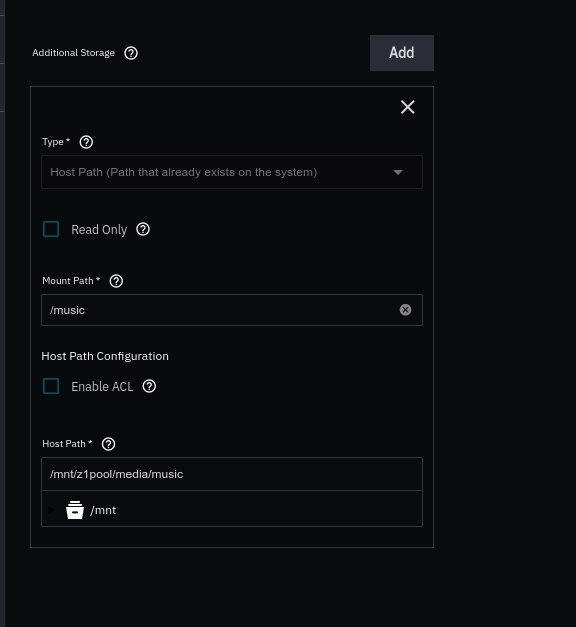

```bash
 _     _____ ___  _   _ _____
| |   | ____/ _ \| \ | |__  /
| |   |  _|| | | |  \| | / / 
| |___| |__| |_| | |\  |/ /_ 
|_____|_____\___/|_| \_/____|
                             
```
# Plex Media Server setup for TrueNAS Scale 24
_Updated August 2024_

**General steps**
- Use this guide: [https://techmikeny.com/blogs/techtalk/how-to-set-up-plex-on-truenas](https://techmikeny.com/blogs/techtalk/how-to-set-up-plex-on-truenas)
- If managing using portainer, may need to install Portainer Agent using  [this config](https://github.com/leonzwrx/homelab-wiki/blob/main/podman_configs/portainer_agent_truenas_docker.txt)

Add music (separate storage mount to /music as shown below)
