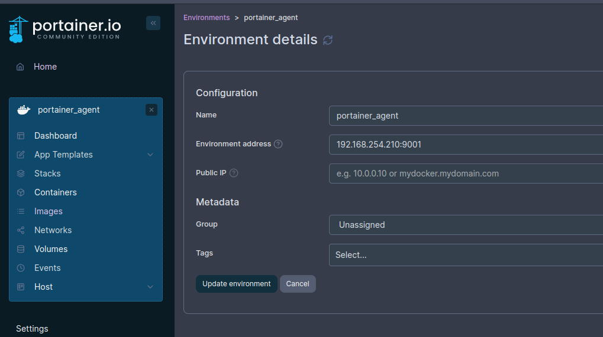

```sh
 _     _____ ___  _   _ _____
| |   | ____/ _ \| \ | |__  /
| |   |  _|| | | |  \| | / / 
| |___| |__| |_| | |\  |/ /_ 
|_____|_____\___/|_| \_/____|
```

# Podman on RHEL 9 Server - basic setup and use in rootless environment

_UPDATED September 2024 - tested on RHEL 9.4 and Podman 4.9_

### Prerequisites
* A RHEL9 system with basic system administration privileges.
* Podman installed: 
	https://podman.io/docs/installation
	`dnf install podman`
* Verify `shadow-utils`, `slirp4netns` packages exist

### Useful links:  
- https://blog.while-true-do.io/podman-systemd-container-management
- https://blog.while-true-do.io/podman-portainer/

### Step-by-Step Guide

#### 1. Create a Dedicated rootless User and Group  
```bash
sudo useradd -d /var/lib/podman_service -m -s /bin/bash podman_service
sudo groupadd podman_group
sudo usermod -aG podman_group podman_service
```
* This creates a new user `podman_service` without a home directory and adds it to the `podman_group`. This user account will be used for running rootless containers

#### 2. Set a Password for the User
```bash
sudo passwd podman_service
```
* Set a strong password for the `podman_service` user.

### 3. Verify Other settings for rootless containers:
- Check `/etc/subuid` and `/etc/subgid` files to verify each user that will be allowed to create containers are listed as described here https://github.com/containers/podman/blob/main/docs/tutorials/rootless_tutorial.md
- For rootless containers, enable "lingering" for the podman_service account: `sudo loginctl enable-linger $USER`
- Test a basic nginx image by creating a container, assigning a newly created network and mapping 80:80 if rootful or 8080:80 if rootless

- Verify whether your rootless configuration is properly set up. Run the following command to show how the UIDs are assigned to the user namespace:

```bash
podman unshare cat /proc/self/uid_map
```

### 4. Start/Stop/Restart
* The `podman generate systemd` command simplifies the process of creating a systemd unit file.
	- Overview of the process: https://www.youtube.com/watch?v=AGkM2jGT61Y
	- Use arguments `--files` and `--name` to generate the file directly and use the container name.
		- Generate a systemd unit file for a rootful container, then copy and daemon-reload: 
	```bash
	podman generate systemd portainer --files --name
	cp container-portainer.service /etc/systemd/system/
	systemctl daemon-reload
	```
	- Generate a systemd unit file for a rootless container:
	```
    	cd ~/.config/systemd/user
     	podman generate systemd portainer_agent --files --name
    	systemctl --user daemon--reload\
	```
	Then change WantedBy section to `WantedBy=default.target`
	
### Notes

* If using Portainer, set up a rootless **Portainer Agent** container to communicate with Portainer, then add as a separate environment (screenshot below) 
* Ensure the `podman_service` user has appropriate permissions to access the Podman socket and volumes.
* Default storage location for rootful containers is `/var/lib/containers/storage`and for rootless - `$HOME/.local/share/containers/storage`
* If having issues with permissions on a NAS volume, add matching user's uid to the ACL in TrueNAS dataset
