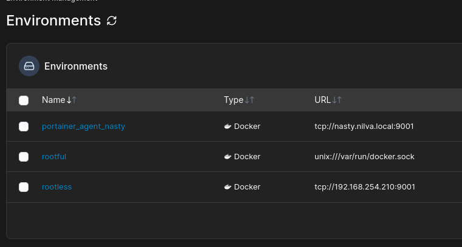
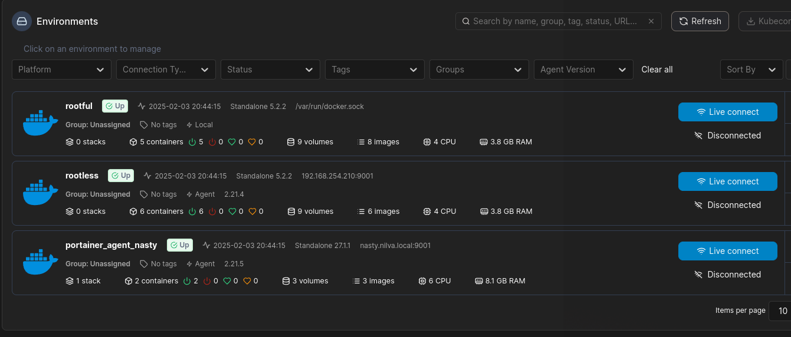

```bash
 _     _____ ___  _   _ _____
| |   | ____/ _ \| \ | |__  /
| |   |  _|| | | |  \| | / / 
| |___| |__| |_| | |\  |/ /_ 
|_____|_____\___/|_| \_/____|
                             
```
# Portainer on podman
_Updated February 2025_

## Pre-requisites/Prep
- RHEL 9 system with `sudo` privileges
- Verify podman is installed and running
- Verify SELinux configured as needed
- Add necessary firewall ports to home zone
```bash
sudo firewall-cmd --permanent --zone=home --add-port=9443/tcp
sudo firewall-cmd --reload
```
**General steps**
- Create volume: `sudo podman volume create portainer_data`
- Pull the image using `sudo podman pull docker.io/pihole/pihole`
- Start the container using the config file [here](https://github.com/leonzwrx/homelab-wiki/podman_configs/portainer.txt)
- Open web browser and browse to `https://<your-server-ip>:9443`
- Create additional users or API keys if needed -  follow [these instructions](https://docs.portainer.io/api/access)
- Test a basic nginx image by creating a container, assigning a newly created network and mapping 80:80 if rootful or 8080:80 if rootless


**Portainer Agents**
- To add additional environments:
     1. Install Portainer Agent on TrueNAS Scale using  [this config](https://github.com/leonzwrx/homelab-wiki/blob/main/podman_configs/portainer_agent_truenas_docker.txt)
     2. Install Portainer Agent in the rootless environment using [this config](https://github.com/leonzwrx/homelab-wiki/blob/main/podman_configs/portainer_agenttxt)
     3. Configure additional environments as seen below
     
     4. Test access to all environments:
     
  
        