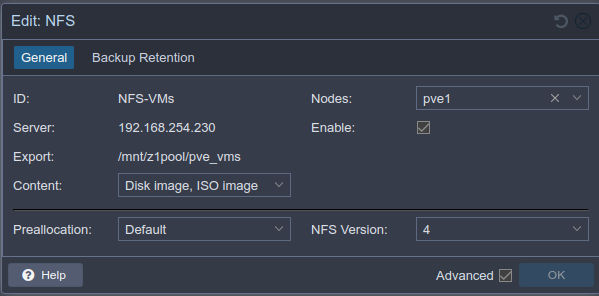
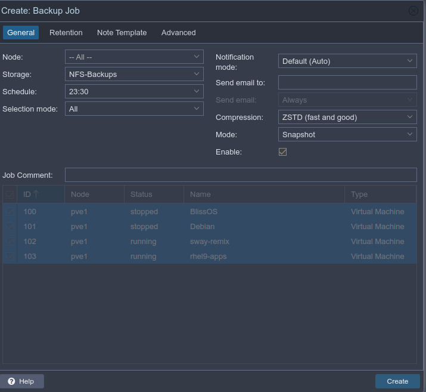
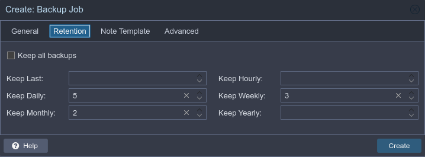

```bash
 _     _____ ___  _   _ _____
| |   | ____/ _ \| \ | |__  /
| |   |  _|| | | |  \| | / / 
| |___| |__| |_| | |\  |/ /_ 
|_____|_____\___/|_| \_/____|
                             
```

## Proxmox 8 Setup
*Updated July 2024*

Links:  
https://www.youtube.com/watch?v=sZcOlW-DwrU
https://www.youtube.com/watch?v=GoZaMgEgrHw
https://technotim.live/posts/first-11-things-proxmox
https://tteck.github.io/Proxmox/#proxmox-ve-post-install

### General steps
- Follow most defaults during install
	+ ext4 on built-in SSD and LVM/LVM-thin setup
	+ Assign static IP, hostname (pve1.domain.local, etc)

- Run Proxmox VE Post Install scripts from :
	```bash
	bash -c "$(wget -qLO - https://github.com/tteck/Proxmox/raw/main/misc/post-pve-install.sh)"
	```
		- correct update sources
		- disable pve-enterprise repos
		- enable `pve-no-subscription` repo
		- correct ceph-package sources

- Continue the rest of the setup via web interface:
	+ Create or add iso datastore
- Via SSH or shell, install some basics
```bash
sudo apt install htop ncdu vim neofetch ranger
```
- Turn on IOMMU if using PCI Passthru via GRUB (steps https://technotim.live/posts/first-11-things-proxmox/)
```shell
nano /etc/default/grub
```
add `iommu=pt` to `GRUB_CMDLINE_LINUX_DEFAULT` like so:

```shell 
GRUB_CMDLINE_LINUX_DEFAULT="quiet intel_iommu=on iommu=pt"
```

If you aren’t using an intel processor, remove intel_iommu=on
then reboot

- Make proxmox VLAN-aware - Go into System - Network - Bridge - Edit (check VLAN-aware)
- Add appropriate datastore / NFS:
	+ Storage tab - add NFS: 
- Backups tab, create backup schedule (make sure NFS-Backups NFS share exists first):
	
	