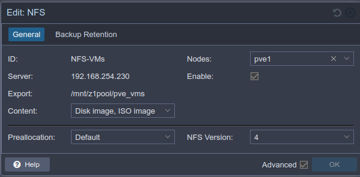
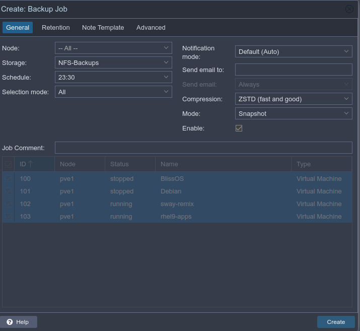
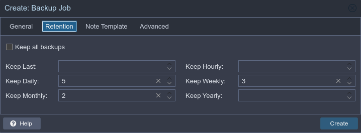
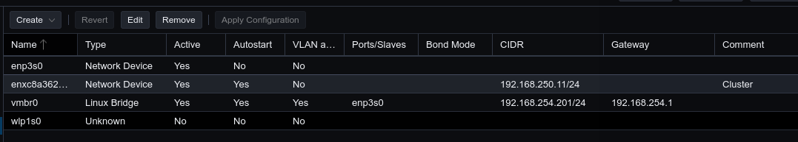
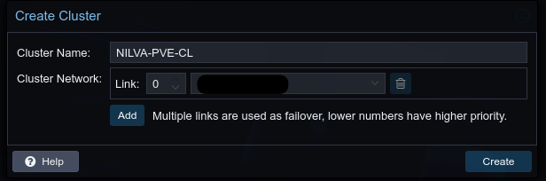
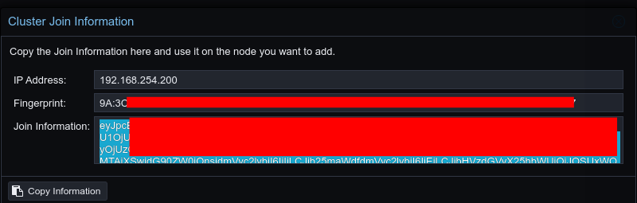

```bash
 _     _____ ___  _   _ _____
| |   | ____/ _ \| \ | |__  /
| |   |  _|| | | |  \| | / / 
| |___| |__| |_| | |\  |/ /_ 
|_____|_____\___/|_| \_/____|
                             
```
This is my Proxmox setup and configuration
# Proxmox 8 Setup
_Updated March 2025_

Links:  
https://www.youtube.com/watch?v=sZcOlW-DwrU
https://www.youtube.com/watch?v=GoZaMgEgrHw
https://technotim.live/posts/first-11-things-proxmox
https://tteck.github.io/Proxmox/#proxmox-ve-post-install

### General steps
- Follow most defaults during install
	+ ext4 on built-in SSD and LVM/LVM-thin setup
	+ Assign static IP, hostname (pve1.domain.local, etc)

- Run Proxmox VE Post Install scripts from :
```bash
    -c "$(wget -qLO - https://github.com/tteck/Proxmox/raw/main/misc/post-pve-install.sh)"
```
- correct update sources
- disable pve-enterprise repos
- enable `pve-no-subscription` repo
- correct ceph-package sources

- Continue the rest of the setup via web interface:
	+ Create or add iso datastore
- Via SSH or shell, install some basics
```bash
sudo apt install htop ncdu vim neofetch ranger
```
- Turn on IOMMU if using PCI Passthru via GRUB (steps https://technotim.live/posts/first-11-things-proxmox/)
```shell
vim /etc/default/grub
```
add `iommu=pt` to `GRUB_CMDLINE_LINUX_DEFAULT` like so:

```shell 
GRUB_CMDLINE_LINUX_DEFAULT="quiet intel_iommu=on iommu=pt"
```

If you aren’t using an intel processor, remove intel_iommu=on
then reboot

- Make proxmox VLAN-aware - Go into System - Network - Bridge - Edit (check VLAN-aware)
- Add appropriate datastore / NFS:
	+ Storage tab - add NFS: 
- Backups tab, create backup schedule (make sure NFS-Backups NFS share exists first):
	
	

### Cluster setup
- General setup: [https://www.youtube.com/watch?v=Ghsa_pcgSvY](https://www.youtube.com/watch?v=Ghsa_pcgSvY)
- Make sure there is a secondary NIC in each node for cluster traffic (labeled Cluster)


1. Create cluster 

2. Use Join information on the first node to join the second node 

3. Make sure all storage is added to all nodes and test migration
4. Re-add homepage API keys, users, permissions from the section below

### Other configs
- For homepage dashboard (or similar), follow [this link](https://gethomepage.dev/widgets/services/proxmox/) to properly create permissions and API key
- Create user **leo** and copy minimal `.bashrc` and install starship, etc - `curl -sS https://starship.rs/install.sh | sh`