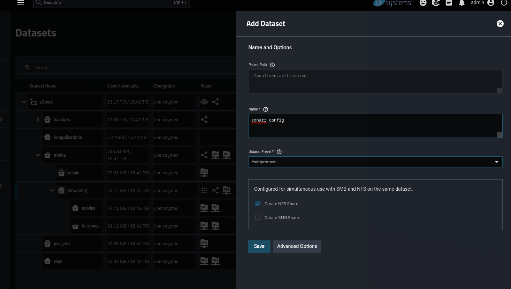
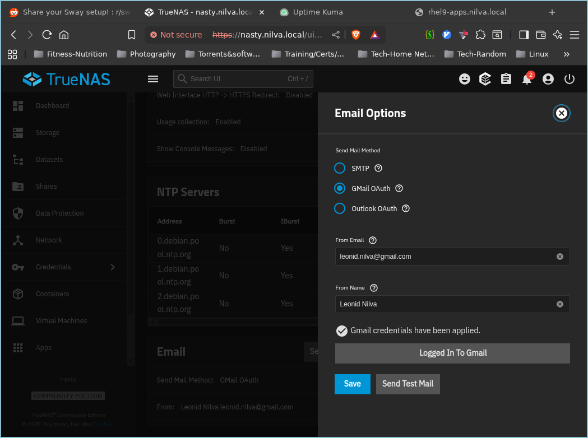

```bash
 _     _____ ___  _   _ _____
| |   | ____/ _ \| \ | |__  /
| |   |  _|| | | |  \| | / / 
| |___| |__| |_| | |\  |/ /_ 
|_____|_____\___/|_| \_/____|
                             
```

# UGREEN 4800 DXP4800 NAS - TrueNAS Scale
_Updated August 2024 - for **Dragonfish-24.04.2**_

### General:
Guide:
https://www.youtube.com/watch?v=C-UI8Wvl9YU
	
- Disable watchdog on UGREEN NAS
- Create RAIDZ1 pool if 4 HDDs or less, otherwise RAIDZ2
- Add Snapshot tasks (daily) - set lifetime to 2 weeks
- Disable sync for datasets that don't need it
- Backup config file
- Disable NFSv3
- Enable SSH
- When creating new datasets, create child datasets for applications/containers to properly see them (vs. creating subdirectories from another machine): **Click _Multiprotocol_**

 
 
> Use preset nfs4_775 and assign `smbuser` permissions where it needs it 

 

 ### SMB Configuration
 `smbuser` for SMB access (edit ACL permissions, leave share permissions alone)
 ### NFS Configuration
 Guide: https://www.youtube.com/watch?v=txx0z-4HlSQ
- When setting permissions, propagate to children if needed
- Restrict networking to specific local subnets or individual hosts

### Management stuff
 
- Set up email, test

- enable SSH and copy ssh pub key for passwordless login, then disable ssh using password
 ```bash
ssh-copy-id admin@nasty.nilva.local
admin@nasty[~]$ grep -i passwordauthentication /etc/ssh/sshd_config            
PasswordAuthentication yes
admin@nasty[~]$ sudo sed -i 's/PasswordAuthentication yes/PasswordAuthentication no/' /etc/ssh/sshd_config
```
### Other permission bits
- Create user `pveuser` for proxmox and assign `rwx` in the ACL
- Create user `leo` (add to admins) to standardize ACLs

- Use **Maproot User** under for each NFS share (Advanced - Access) and select `root`, `pveuser`, etc
- For applications/containers, such as **PLEX**, that application's user (default is `apps` must be in the ACL as seen below:
 
### Applications/Containers
 Plex storage config shown below (user ID set to 3000)  

 

### API
To create an API Key, follow the official TrueNAS documentation [here](https://www.truenas.com/docs/scale/scaletutorials/toptoolbar/managingapikeys/)
