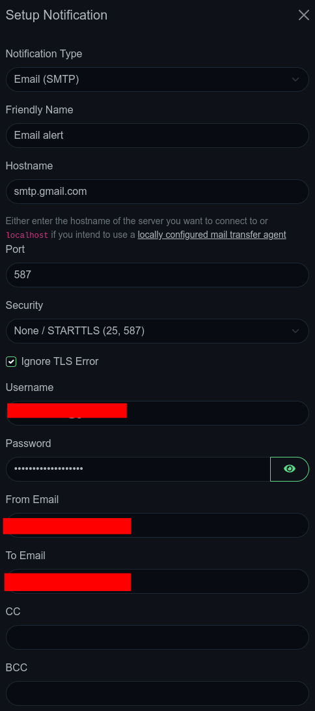
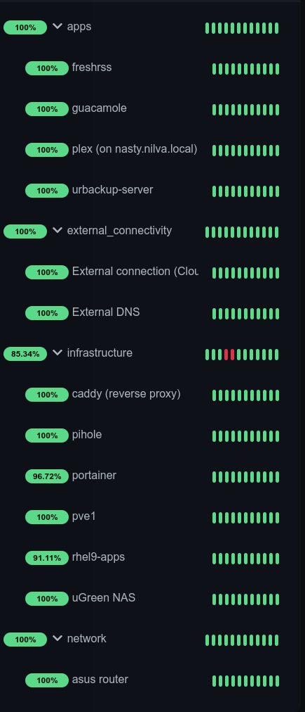
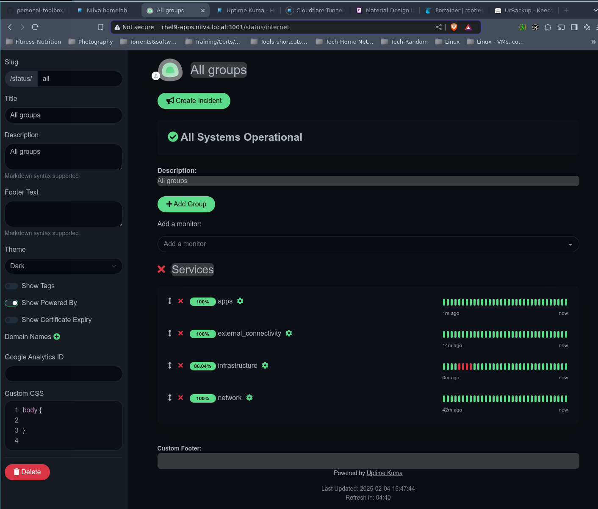

```
 _     _____ ___  _   _ _____
| |   | ____/ _ \| \ | |__  /
| |   |  _|| | | |  \| | / / 
| |___| |__| |_| | |\  |/ /_ 
|_____|_____\___/|_| \_/____|
```
_Updated February 2025_

# Uptime Kuma guide
Solid general guide [here](https://betterstack.com/community/guides/monitoring/uptime-kuma-guide/)

## Pre-requisites/Prep

1. Verify podman functions correctly and rootless containers can be deployed
2. Add necessary firewall ports to home zone (avoiding default ports 80 and 443)
```bash
sudo firewall-cmd --permanent --zone=home --add-port=3001/tcp
sudo firewall-cmd --reload
```
3. Create podman volumes:
```bash
podman volume create uptime-kuma_data
```
4. Pull the image
```bash
podman pull uptime-kuma louislam/uptime-kuma:latest
```
5. Start the container using the config file [here](https://github.com/leonzwrx/homelab-wiki/podman_configs/uptime-kuma.txt)

## Setup / Configuration
1. Go over basic configuiration and set up timezone, appearance/theme
2. Set up notifications/SMTP settings:


3. Set up monitors and groups


4. Once all monitors are established, create status page(s) that can be referenced by dashboard widgets and add the groups to it
