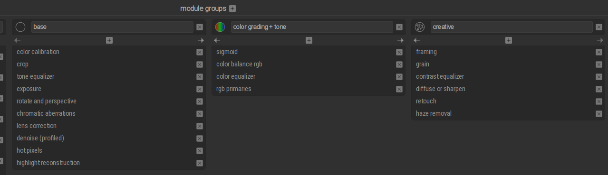

```bash
 _     _____ ___  _   _ _____
| |   | ____/ _ \| \ | |__  /
| |   |  _|| | | |  \| | / / 
| |___| |__| |_| | |\  |/ /_ 
|_____|_____\___/|_| \_/____|
                             
```

# darktable - main guide
_Updated February 2026_

[CREDITS]
[Kevin Ajili](https://www.youtube.com/@kevinajili)
[darktable Landscapes](https://www.youtube.com/@darktableLandscapes)
[Bruce Williams](https://www.youtube.com/channel/UCkqe4BYsllmcxo2dsF-rFQw)

## 🔗 Quick Navigation

**Core Workflows:**
- [My Main Workflow (Option 1)](#my-main-workflow-option-1)
- [Quick Edit Workflow (Option 2)](#quick-edit-workflow-option-2)

**Processing Sections:**
- [Base Adjustments](#base-adjustments)
- [Color Processing](#color-processing) 
- [Color Grading](#color-grading)
- [Creative Effects](#creative-effects)
- [Useful Modules](#useful-modules)

**Tools & Management:**
- [Masking](#masking)
- [Styles & LUTs](#styles--luts)
- [Rating System](#rating-system)
- [After Editing](#after-darkroom-edits)
- [Useful Scripts](#useful-scripts)
- [Installation & Setup](#installation--setup)

---

## My Main Workflow (Option 1) {#my-main-workflow-option-1}

> Reference [this video from Kevin](https://www.youtube.com/watch?v=ZUc6LOzg_Nk) for 5.0+ workflow and settings



### Initial Setup
- Make sure defaults and presets are setup as described in the video
- Auto-apply the following to all (raw only): **lens correction, hotpixels, denoise (profiled), chromatic aberrations, color balance rgb (based on basic colorfullness standard**
  

### Base Adjustments {#base-adjustments}

1. **exposure** (shortcut: e). Use lightbulb (**Ctrl-B** for white border reference)
2. **color calibration**.  _Instead of white balance_ Use the eye dropper to sample a neutral area, dragging the box around for variations, then fine-tune. Leave WB module at D65 if using color calibration in the pipeline.  Check that "area color mapping" is set to (50, 0°, 0). For the most part, WB module set on Camera reference and CC module set to 'as shot' should be identical
3. **crop** (shortcut: c)
4. **rotate & perspective**. Right-click to draw a line that will align the photo (or **alt-r** to rotate or **alt-[ and ]** for fine adjustment)
5. **tone equalizer** (shadows & highlights is simpler but deprecated):
   - The advanced tab shows a curve that represents the adjustments. Its histogram shows the mask it creates.
   - The masking tab helps create a mask based on tonal values. **The entire module has its own mask via this tab**
   - The "magic wands" can help create an initial mask.
   - Verify the mask doesn't cause clipping (indicated by colors).
   - Use "guided filter" or "EIGF" (preserves contrast) for smoother transitions.
   - Scroll wheel on the image may be an easier way to adjust different zones 
   - A good starting preset without even using mask is often "compress shadows/highlights EIGF soft," then adjust the curve.

### Color Processing {#color-processing}

1. **color balance rgb** - used for both saturation & contrast - use either same instance or separate. OK to generally increase saturation in the shadows and decrease it in the highlights. 
   
   **COLOR:**
   master tab:
   - Use _global vibrance_ slider to adjust overall colorfullness but if not enough, then:
   - [OPTIONAL] _chroma_ sliders adjust colors without affecting luminance
   - [OPTIONAL] _saturation_ sliders apply absolute amount (standard preset already adds some saturation)
   
   **CONTRAST:** - optionally make a separate instance from Saturation above
   master tab:
   - Adjust mid-tones, shadows and highlights under _brilliance_ grading
   4-ways tab:
   - Use _global offset luminance_ slider to adjust black level for more contrast adjustments. For filmic look, slightly increase.

2. **Sigmoid** - should already be set. Use **smooth** profile as an option for a good look especially for photos with heavy highlights like sunsets
   - Adjust _contrast_ slider (if color rgb wasn't enough) and _skew_ slider to move contrast towards highlights or shadows
     > Note - increasing contrast also increases saturation
   - _preserve hue_ slider may or may not make a photo more interesting (such as to make highlights glow more, like fire or sunsets). **38%** works well
   - _target_ sliders usually OK to stay at default but similar to luminance sliders used in color rgb
   - _primaries_ sliders (smooth preset looks good usually without messing with these sliders):
     - attenuation add or decrease saturation for each color in **highlights** only
     - rotation add or decrease hue in **highlights** only

### Color Grading {#color-grading}

1. **rgb primaries** - simpler channel mixer for broader changes before color equalizer is used for more detailed adjustments
   - Change hue of each channel towards opposite color (reds towards magenta, etc). purity controls saturation

2. **color equalizer** - adjust specific colors or use **picker** on the image, then use _node placement_ to align the dot
   > color look up table module can be used for quick color replacements with color picker tool 
   - hue tab is rarely used since rgb primaries should do a good job. Middle-click to reveal sliders for each color
   - brightness and saturation tabs can be used for fine adjustments

3. **color balance rgb** - used for **split toning** (make a new instance) in the **4-ways tab**
   - Use the _hue_ slider to select color from the image or use picker, then use _chroma_ slider for color gain
   - Do this for shadows, then repeat for highlights (although highlights effect is small)

### Creative Effects {#creative-effects}

1. **diffuse or sharpen** - select preset sharpen demosaicing AA filter should provide a natural sharpness level
   _lens deblur medium_ is another good preset for sharpness

2. **contrast equalizer** - similar to Clarity in Lightroom when _clarity_ preset is used
   - On the _Luma_ tab, use mix slider to change positive or negative clarity
   - If more control is needed in just coarse areas or fine areas, adjust parts of the graph. Increasing _fine_ areas adds more sharpness/micro-contrast. Or bring down the _coarse_ side to apply negative clarity without messing with sharpness

> **NOTE on Sharpening:** the diffuse or sharpen module is generally preferred for modern, high-quality, and nuanced sharpening (including deblurring and lens deconvolution), while the contrast equalizer (luma tab) is faster for rapid, output-stage sharpening of fine details. Diffuse or Sharpen offers superior, physical-based sharpening without artifacts, whereas contrast equalizer is excellent for boosting edge contrast.

3. **[OPTIONAL] Glowing effect** - diffuse or sharpen: make new instance, apply preset bloom, adjust opacity
4. **haze removal** - Increase or decrease (for a gloomy look) haze
5. **grain**
6. **blur** - can be used with brush/path masking on skin
7. **retouch** - use shape/brush/path to select areas
8. **framing**
9. **watermark**

---

## Quick Edit Workflow (Option 2) {#quick-edit-workflow-option-2}

Use [Rico's guide](https://www.youtube.com/watch?v=pGQnwBbO1uc) for basics. At the very least, use:
- sigmoid / contrast
- color balance rgb (chrome / saturations sliders)
- color equalizer
- color calibration
- tone equalizer (start with presets as a baseline)
- exposure/lens correction/denoise should already be set

---

## Useful Modules {#useful-modules}

- **color zones** for hue, chroma, lightness of areas of the photo (i.e. brighten up greens and desaturate reds) - if color equalizer doesn't suffice
- **velvia** - primarily boosts saturation and contrast in a way that often emphasizes warmer tones and creates a punchy, vivid look
- **hot pixels** - remove abnormally bright pixels. Should be enabled by default in my workflow above
- **vignette / graduated density** - simulate optical graduated ND filter

---

## After Darkroom Edits {#after-darkroom-edits}

1. Check for any clipping (o)
2. Export photo, (re) apply any styles - 90% quality good for most uses with manageable file size. Use srgb profile and high quality resampling options
3. Tag as needed including style
4. Geotag
5. Rate and/or apply color ratin_
6. Delete rejected photos

---

## Masking {#masking}

**Example - Parametric**
- Select parameter / channel
- Turn on preview (yellow area is selected)
- Use sliders to make exact or smooth selection area
- Use feathering to decrease harshness in the mask
- Turn off preview (unselect yellow)
- Use module's power button to see before/after of the module w/mask applied
- To reuse masks, use Mask Manager and select existing masks or mask groups from another module

### Masking Tips
- When drawing a mask, good practice to always **Ctrl-click** to add multiple brush strokes
- Right-clicking a mask on the image removes it
- When using elliptical mask, **Shift-left click** changes feather from proportional ratio to uniform
- When using path mask using **Ctrl-click** for hard shapes like triangles
- **Ctrl-click** to add a node to an existing mask to make a more detailed mask shape. Right-click on node to remove the node
- Use eye dropper to select exact color for the channel sliders 
- **Uniformity** provides opacity/strength for ANY module. It's an easy way to back down the effect of a full module stack.
- Use M key to show/hide all masks
- **Shift+M** toggles mask visibility for active module only

---

## Styles & LUTs {#styles--luts}

> Using basic styles like in-camera JPEG rendition is a good starting point - These styles only affect contrast, brightness, and saturation and do not attempt to match **sharpening, denoising, or hue shifts**. There is also a Lua script to auto-apply the appropriate style on import and manually apply styles to a collection of previously-imported images.
> When applying a style, it's best to start with the original, unedited image in the history stack
> Workflow should focus around OSC principal (Overall, Subject, Colors)

### dtstyles
- Download .dtstyle files and store in `~/Pictures/darktable`
- If saving a new style, only save relevant modules and avoid defaults like sigmoid which will be auto-applied anyway
- Create a style by compressing history stack first - important to click 'module order'
  > If using a style, indicate the style name in the snapshot and/or duplicate. There should also be an associated tag with the style
- If using [Kevin's creative styles](https://github.com/kajili/darktable-styles), exposure and color/calibration are excluded - those still have to be applied per photo
- If **updating** a style, compress history stack, make changes, compress history stack again before re-saving with the same exact name, overwrite
- When applying a style - use 'overwrite' for creative/general styles and 'append' for _tools_ type of styles

### Film LUTs
- For LUTs - apply specific profile, then use the _circle_ mask icon (uniformly) to change opacity/strength of the LUT
  > haldcluts (.png files) are mostly deprecated and modern .cube LUTs are preferred
  > These can be found in various LUT repos, particularly [YahiaAngelo, 3D LUTs](https://github.com/YahiaAngelo/Film-Luts/) or (for now deprecated) [t3mujinpak](https://github.com/t3mujinpack/t3mujinpack)
  > Current favorite LUTs are from [RawTherapee](https://rawpedia.rawtherapee.com/Film_Simulation)

### Recommended Film LUTs
**Black & White:**
> If manually converting to B&W, color calibration module has good film presets
- **Ilford HP5 Plus 400:** A classic black and white film known for its versatility, good grain structure, and pleasing tonality. Often a go-to for general B&W work.
- **Kodak Tri-X 400:** Another iconic B&W film, often favored for its distinctive grain and contrast. Great for a more gritty or dramatic B&W look.
- **Ilford Delta 100:** Known for its very fine grain and smooth tonality, excellent for high-detail B&W images.
- **Fuji Neopan Acros 100:** Known for its extremely fine grain and high sharpness, often favored by architectural and landscape photographers.

**Color Negative:**
- **Kodak Portra 400:** Extremely popular for its natural skin tones, smooth gradients, and versatility. Often used for portraits, landscapes, and general photography.
- **Fuji Pro 400H:** Another favorite for portraits and natural colors, often described as having a slightly cooler and more pastel rendition compared to Portra.
- **Kodak Ektar 100:** Known for its very fine grain and vibrant, yet realistic, color rendition. Popular for landscapes and detailed subjects.
- **Fuji Superia 400:** A popular consumer film known for its punchy colors and versatility.

**Color Slide:**
- **Fuji Velvia 50:** Famous for its incredibly saturated and contrasty colors, often used for landscapes and nature photography when vividness is desired.
- **Fuji Provia 100F:** A more neutral and versatile slide film with fine grain and accurate colors, often used for a wide range of subjects.
- **Kodak Ektachrome 100 G:** Known for its relatively neutral color balance and fine grain.

---

## Rating System {#rating-system}

### Star Ratings
- **1 star** for a photo I want to keep but not show (for record purposes, part of a pano series, etc.)
- **2 stars** for a photo I will show as part of a photo album
- **3 stars** for a photo I would put up on my wall
- **4/5 stars** for a portfolio-worthy photo

### Color Ratings
- **🟣 Purple:** Editing done, finished
- **🔴 Red:** "Needs Editing" - photos that are flagged for editing but not yet started. Example: Raw files that are high-priority or part of a client project.
- **🟡 Yellow:** "In Progress" - Photos you're actively editing (e.g., halfway through adjustments).
- **🟢 Green:** "Ready for Export" - edited photos that just need final export (resizing, sharpening, etc.).
- **🔵 Blue:** Part of Panorama stack while editing.

---

## Useful Scripts {#useful-scripts}

### Rename Images
Use to rename existing directories and raw/xmp files:
1. Select all images inside that folder in lighttable.
2. Ensure the Jobcode/import job is set i.e. Liliyas_65th_birthday (use underscores) in the Metadata panel.
3. Paste this string into the rename images module:

`/home/leo/Pictures/Darktable/2025/$(EXIF.YEAR)-$(EXIF.MONTH.LONG)-$(JOBCODE)/$(JOBCODE,,)-$(EXIF.YEAR)-$(EXIF.MONTH.LONG,,)-$(EXIF.DAY)-$(EXIF.HOUR).$(EXIF.MINUTE).$(EXIF.SECOND).$(FILE.EXTENSION)`

or if Jobcode isn't set, re-import the folder as well as any other variables like month if needed:

`/home/leo/Pictures/Darktable/2025/$(EXIF.YEAR)-$(EXIF.MONTH.LONG)-Liliya_65th_birthday/liliya_65th_birthday-$(EXIF.YEAR)-$(EXIF.MONTH.LONG,,)-$(EXIF.DAY)-$(EXIF.HOUR).$(EXIF.MINUTE).$(EXIF.SECOND).$(FILE.EXTENSION)`

### Image Time
Adjust timestamps across multiple images (align cameras)

---

## Installation & Setup {#installation--setup}

### Quick Setup
- On Debian Trixie, install repo for Debian Testing (stable) section: [here](https://software.opensuse.org/download.html?project=graphics:darktable&package=darktable); alternatively install using .deb manually
- **Verify OpenCL/ROCM drivers** - run `darktable-cltest` to check if OpenCL is available

### Update Lens and Camera Database
```bash
sudo apt install liblensfun-bin
lensfun-update-data #use sudo for system-wide update
```

### General Tips
- **Right-Click for Value Input:** Right-clicking on sliders or numerical values allows you to type in precise values.
- **Double-Click to Reset:** Double-clicking on a slider or numerical value resets it to its default setting.
- **Ctrl-Alt + Scroll wheel** to scroll without adjusting sliders
- **Scroll Wheel for Fine Adjustments:** Use your mouse scroll wheel to make small adjustments to sliders. Holding **Shift** or **Ctrl** while scrolling allows for coarser/finer adjustments.
- **Middle mouse button** is 200% zoom
- Clicking on a brush or shape (like in masking) while holding **Ctrl** keeps the brush enabled (vs exiting the brush)
- When using a tool - to zoom instead of adjusting a control/shape, hold down the 'a' key while scrolling

### Module Presets
- Create and save module presets for frequently used settings. This saves time and ensures consistency.
- You can right click on the module name to save presets.
- Hovering over the preset in a module (like LUTs) allows you to use the mouse wheel to scroll through the LUTs stored in that directory

### Duplicates
- Use duplicates for things like multiple versions of the same photo (different styles, crops, frames) or to test edits safely

---

## 📚 Related Resources
- **[Darktable JPEG Workflow](./darktable_jpeg_workflow.md)** - My optimized export workflow
- _[Darktable Lightroom-ish Workflow](./darktable_lightroom-ish_workflow.md)_ (archive)
- [Official Darktable Manual](https://www.darktable.org/usermanual/en/)

_Documentation for personal reference - workflow optimized for my needs._